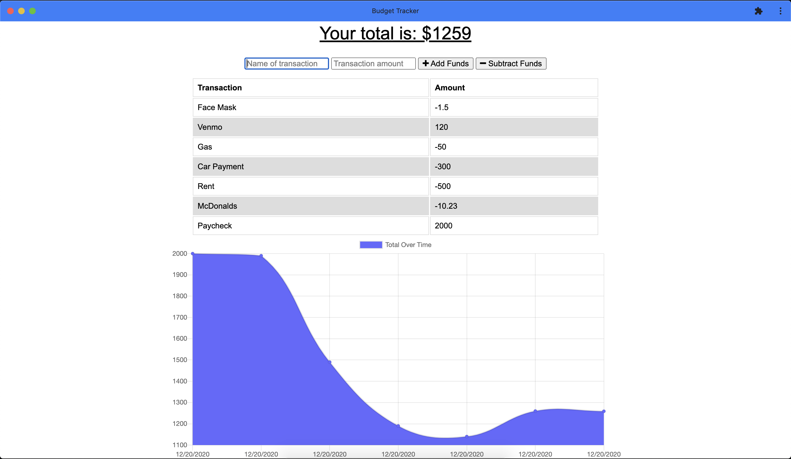

# Budget Tracker

## Description
Budget Tracker is a Progressive Web Application for tracking fiances and budget. User will be able input funds weather it is a form of income or an expense. A visual graph will display the user's budget over time. Functionality is still attainable even when the application goes offline. 

## Table of Contents
* [Installation](#installation)
* [Usage](#usage)
* [License](#license)
* [Contribution](#contribution)
* [Test](#test)
* [Questions](#questions)

## Installation
Clone repository from (https://github.com/ginomaglaqueucla/budget-tracker-gm20.git) to local directory on computer.
1. Download/Obtain source code locally from GitHub Repository
2. Open terminal or gitbash command line, Change Directory (cd) to location of working directory
3. Enter `npm install`, to download dependicies
4. Enter `npm start`
5. Use REST API client to CRUD database

## Usage
- User inputs "fund" or "transaction" name and ammount. 
- Depending weather the item is income or an expense user will select the corresponding button
- Notice updates on the graph

## License

MIT License

Copyright (c) [2020] [Gino Maglaque]

Permission is hereby granted, free of charge, to any person obtaining a copy of this software and associated documentation files (the "Software"), to deal in the Software without restriction, including without limitation the rights to use, copy, modify, merge, publish, distribute, sublicense, and/or sell copies of the Software, and to permit persons to whom the Software is furnished to do so, subject to the following conditions:

The above copyright notice and this permission notice shall be included in all copies or substantial portions of the Software.

## Contribution
This project uses the following external: 
- npm express
- MongoDB
- Mongoose ODM
- morgan
- dotenv
- compression

To contribute to this project:
1. Clone repository from Installation section
2. Pull latest code locally, Create new working branch
3. Push up newly created branch
4. Create Pull Request and add reviewers when ready to merge with main code

## Test

## Questions
Any questions? Contact at: ginomaglaque@gmail.com

GitHub: [ginomaglaqueucla](https://github.com/ginomaglaqueucla)